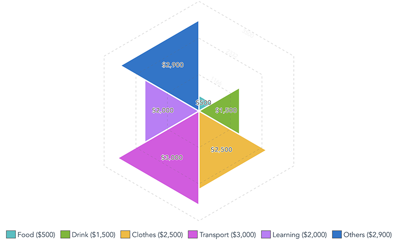
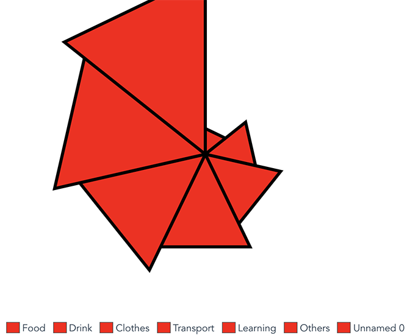

# Vue.js Triangled Spider Chart
A Vue.js component that displays a triangled style spider chart.



## Simple setup
```
npm install triangled-spider-chart
```

## Simple usage
In the script
```
import TriangledSpiderChart from "triangled-spider-chart";

export default {
  ...
  components: {
    TriangledSpiderChart
  },
  data() {
    return {
      chartData: [5, 10, 15, 20, 25, 30, 35]
    }
  }
}
```
In the template
```
<TriangledSpiderChart
  :chartData="chartData"
></TriangledSpiderChart>
```

### Customize configuration
#### Properties
- **size**: *Number* Dimension (for both width and height) of the chart. Default is 300.
- **max**: *Number* Maximum value to display within the chart. Maximum value of **chartData** if omitted.
- **chartData**: *Array|required* Chart series data. Ex: [5, 10, 15, 20, 25, 30, 35]
- **options** *Object* Custom styling for the chart.

##### The options definition
- **strokeWidth**: *Number* Size of the chart serie stroke. Default is 3.
- **strokeColor**: *Number* Color fo the chart serie stroke. Default is White.
- **fills** *String|Array* Fill colors of chart series. Ramdomize colors if omitted.
- **hoverFills** *String|Array* Fill colors of chart series when mouse over. Opacity to 75% if omitted.

## Full options example
In the script
```
import TriangledSpiderChart from "triangled-spider-chart";

export default {
  ...
  components: {
    TriangledSpiderChart
  },
  data() {
    return {
      chartSize: 500,
      chartMax: 35,
      chartData: [5, 10, 15, 20, 25, 30],
      chartOptions: {
        strokeWidth: 5,
        strokeColor: '#000000',
        fills: ['#25C1C3', '#6CB91A', '#F7BA1B', '#E24CE5', '#C378FB', '#1674CD'],
        hoverFills: ['#25C1C3BF', '#6CB91ABF', '#F7BA1BBF', '#E24CE5BF', '#C378FBBF', '#1674CDBF']
      }
    }
  }
}
```
In the template
```
<TriangledSpiderChart
  :size="chartSize"
  :max="chartMax"
  :chartData="chartData"
  :options="chartOptions"
></TriangledSpiderChart>
```

#### Result


## Full options example (1 fill color)
In the script
```
import TriangledSpiderChart from "triangled-spider-chart";

export default {
  ...
  components: {
    TriangledSpiderChart
  },
  data() {
    return {
      chartSize: 500,
      chartMax: 30,
      chartData: [5, 10, 15, 20, 25, 30, 35],
      chartOptions: {
        strokeWidth: 5,
        strokeColor: '#000000',
        fills: '#ff0000', // all series will be fill Red.
        hoverFills: '#00ff00' // all series will be fill Green when mouse over.
      }
    }
  }
}
```
In the template
```
<TriangledSpiderChart
  :size="chartSize"
  :max="chartMax"
  :chartData="chartData"
  :options="chartOptions"
></TriangledSpiderChart>
```

#### Result

